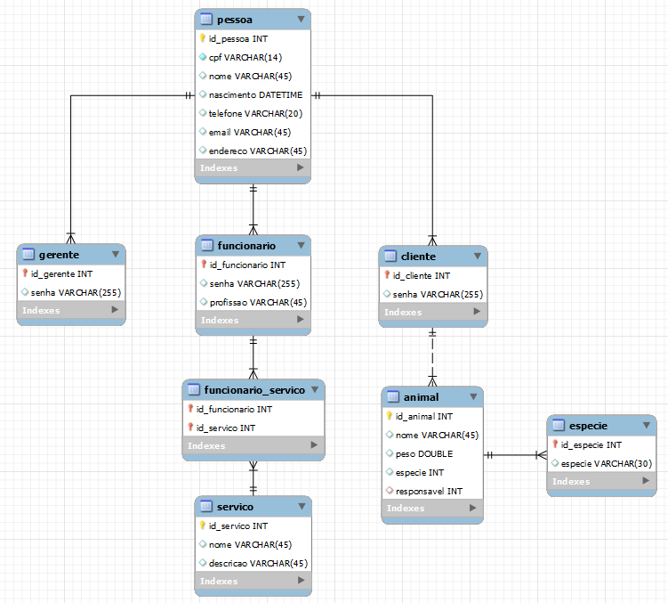

# Doctor Pet

Projeto Final do Curso Técnico Integrado de Desenvolvimento de Sistemas - Colégio Pedro II - Campus Duque de Caxias

**Integrantes:**
 - Jhonatha Rodrigues dos Santos
 - Nicoly Ferreira Gomes
 - Ramon Brasil Barboza Ofemann
 - Thainá Schayder Valadão

 ## Descrição do Projeto

 O site da empresa fictícia Doctor Pet tem como objetivo o agendamento online de consultas veterinárias. O site disponibilizará um login para o cliente, funcionário e o gerente, podendo ser efetuada o agendamento de consultas, assim como remarcar e cancelar as consultas.

## Documentação

- [Manual do Usuário](manual.md)
- [Requisitos](requisitos.md)
- [Casos de Uso](casos-de-uso.md)
- [Apresentação](apresentacao.pdf)

**Diagrama de Classes**

**Modelagem do Banco de Dados**

