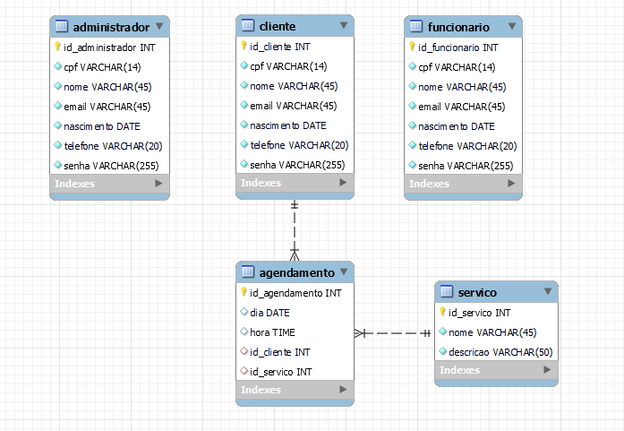

# Doctor Pet

Projeto Final do Curso Técnico Integrado de Desenvolvimento de Sistemas - Colégio Pedro II - Campus Duque de Caxias

**Integrantes:**
 - Jhonatha Rodrigues dos Santos
 - Nicoly Ferreira Gomes
 - Ramon Brasil Barboza Ofemann
 - Thainá Schayder Valadão

 ## Descrição do Projeto

 O site da empresa fictícia Doctor Pet tem como objetivo o agendamento online de consultas veterinárias. O site disponibilizará um login para o cliente, funcionário e o gerente, podendo ser efetuada o agendamento de consultas, assim como remarcar e cancelar as consultas.

## Documentação

- [Manual do Usuário](manual.md)
- [Requisitos](requisitos.md)
- [Casos de Uso](casos-de-uso.md)
- [Apresentação](apresentacao.pdf)

**Modelagem do Banco de Dados**

Preencha os campos Dia e Hora assim, logo pós clique no Botăo enviar.

Espere a mensagem de confirmação do cancelamento da consulta ser exibida na tela, para clicar no botão Voltar para o início.

Espere a mensagem de confirmação do agendamento da consulta ser exibida na tela, para clicar no botão Voltar para o  inicío.

A tela exibirá o Dia e Hora cadastrados, após a verificação dos campos ,clique no botão Voltar para o início.

 Os dados da consulta será exibido na tela, para que os dados sejam excluídos ,clique no botão Excluir agendamento   .

Logo após preencher Dia e Hora clique no botão Agendar consulta, para escolher o tipo de consulta.

