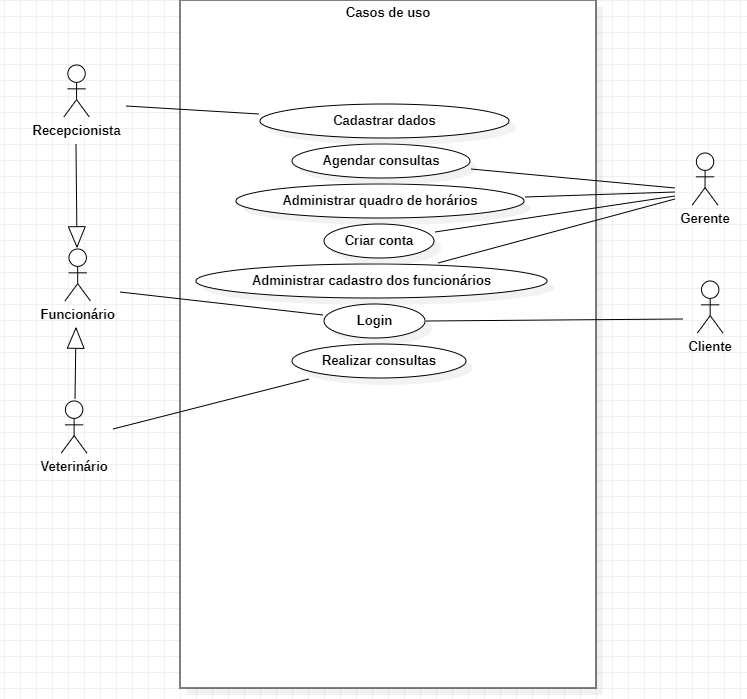

# Documento de Casos de Uso

## Lista dos Casos de Uso

 - [CDU 01](#CDU-01): Login
 - [CDU 02](#CDU-02): Administrar quadro de horários
 - [CDU 03](#CDU-03): Administrar cadastro dos usuários
 - [CDU 04](#CDU-04): Agendar consultas
 - [CDU 05](#CDU-05): Editar consultas 
 - [CDU 06](#CDU-06): Cadastrar dados dos clientes
 - [CDU 07](#CDU-07): Cadastrar dados dos funcionários
 - [CDU 08](#CDU-08): Criar serviços
 - [CDU 09](#CDU-09): solicitar serviços
 
## Lista dos Atores
- Gerente  
- Funcionário  
- Veterinário  
- Recepcionista  
- Cliente

## Diagrama de Casos de Uso

## Descrição dos Casos de Uso

### CDU 01 - Login
Ator
-Gerente
-Funcionário
-Cliente 

**Fluxo Principal**

1. O sistema solicita login e senha ao usuário. 
2. O usuário funcionário informa login e senha. 
3. Os dados são validados no Sistema Externo. 
4. O sistema exibe que o login e senha são válidos. 
5. O acesso ao sistema é liberado.

**Fluxo Alternativo**

1. Login e/ou senha inválidos.
2. O sistema exibe que o login e/ou senha são inválidos. 
3. O fluxo retorna ao passo 1 do fluxo principal.

### CDU 02 - Administrar quadro de horários
Ator
-gerente
-recepcionista
-Veterinário

**Fluxo Principal**

1. O sistema solicita identificação do usuário.
2. O usuário tem permissão para acessar o quadro de horário.
3. O sistema exibe uma mensagem de confirmação.
4. O sistema libera o acesso ao quadro de horário.
4. O usuário verifica dia/horário de cada profissional.
 

**Fluxo Alternativo**

1. O sistema solicita identificação do usuário.
2. O usuário não tem permissão para acessar o quadro de horário.
3. O sistema exibe uma mensagem de erro.
3. O sistema retorna ao passo 1 do fluxo principal.

### CDU 03 - Administrar cadastro dos usuário

Ator
-Gerente

**Fluxo Principal** 

1. O usuário seleciona a opção cadastrar usuário no menu principal. 
2. O usuário escolhe a opção cadastrar Profissional.
3. O sistema solicita os dados necessários para o cadastro do Profissional.
4. O usuário fornece os dados e confirma a operação.
5. O sistema verifica se todos foram fornecidos.
6. O sistema exibe uma mensagem de confirmação.

**Fluxo Alternativo A**
 
1. O usuário seleciona a opção Excluir Profissional. 
2. O sistema solicita o código do profissional a ser excluído. 
3. O usuário escolhe a opção Cancelar.
4. O sistema exibe uma mensagem de confirmação.

**Fluxo Alternativo B**
 
1. O usuário escolhe a opção Alterar Profissional. 
2. O sistema solicita o código do Profissional a ser alterado. 
3. O usuário escolhe a opção Cancelar.

### CDU 04 - Agendar Consulta
Ator
-Cliente
-Recepcionista 
-Gerente

 **Fluxo principal**
1. O usuário seleciona a opção Agendar no menu principal.
2. O usuário escolhe a opção Agendar consulta.
3. O sistema solicita os dados necessários para o agendamento do cliente. 
4. O usuário fornece os dados e confirma a operação.
5. O sistema verifica se todos os dados foram fornecidos.
6. O sistema exibe uma mensagem de confirmação. 

**Fluxo Alternativo A**
1. O usuário seleciona a opção Excluir Agendamento. 
2. O sistema solicita o código do agendamento a ser excluído. 
3. O usuário escolhe a opção Cancelar. 
4. O sistema volta ao passo 4 do Fluxo Principal.

**Fluxo Alternativo B**
1. O usuário escolhe a opção Alterar Agendamento. 
2. O sistema solicita os dados para a alteração dos agendamento. 
3. O usuário escolhe a opção Cancelar. 
4. O sistema volta ao passo 4 do Fluxo Principal.

### CDU 05 - Editar consultas
Ator
-Recepcionista
-Veterinário

**Fluxo principal**

1. O recepcionista digita os dados do cliente no sistema.
2. O sistema confirma a consulta do cliente.
3. O sistema envia a ficha do cliente ao veterinário.
4. O veterinário abre a ficha do cliente.
5. O veterinário cria um relatório da consulta.
6. O sistema adiciona o novo relatório a  ficha do cliente.

### CDU 06 - Cadastrar dados do usuário
Ator
-Cliente
-funcionário
-Gerente
-Recepcionista

**Fluxo Principal**

1. O usuário enviará seus dados ao sistema.
2. O gerente receberá os dados do usuário. 
3. O gerente fará a validação dos dados.
4. Após a validação, os dados serão enviados para a recepcionista.
5. A recepcionista inserirá os dados no prontuário.

**Fluxo Alternativo A**

1. O usuário enviará seus dados ao sistema.
2. O gerente receberá os dados do usuário.
3. Dados não validados pelo gerente.
4. O cliente deverá reenviar os seus dados para validação.

### CDU 07 -Cadastrar dados do funcionário
Ator
-Funcionário
-Gerente
-Recepcionista

**Fluxo Principal**

1. O funcionário enviará seus dados ao sistema.
2. O gerente receberá os dados do funcionário. 
3. O gerente fará a validação dos dados.
4. Após a validação, os dados serão enviados para a recepcionista.
5. A recepcionista inserirá os dados no prontuário.

**Fluxo Alternativo A**

1. O funcionário enviará seus dados ao sistema.
2. O gerente receberá os dados do funcionário.
3. Dados não validados pelo gerente.
4. O funcionário deverá reenviar os seus dados para validação.

### CDU 08-Criar serviços
Ator
-Gerente

1. O caso de uso inicia com o ator administrador solicitando a criação de um novo serviço.
2. O sistema apresenta o formulário para ser preenchimento.
3. O ator administrador preenche o formularuo.
4. O sistema válida os dados do serviço.
5. O sistema armazena os dados do serviço.
6. O sistema envia ao ator administrador uma mensagem de confirmação.
7. O caso de uso encerrado.
 

### Fluxo alternativo de criar serviço:

1. O caso de uso inicia com o ator administrador solicitando a criação de um novo serviço.
2. O sistema apresenta o formulário para ser preenchimento.
3. O ator administrador não preenche adequadamente o formulário. caso de uso encerrado.
4. caso de uso encerrado.

### CDU 09 -solicitar serviços
Ator
-recepcionista

**Fluxo Principal**
1. O sistema exibe os serviços;
2. O(a) recepcionista seleciona o serviço desejado;
3. O sistema verifica se o serviço estar disponivél;
4. O sistema confirma o agendamento.

**Fluxo Alternativo A**
1. O sistema exibe os serviços;
2. Nenhum serviço é solicitado;
3. O sistema encerra a ação.

**Fluxo Alternativo B**
1. O sistema exibe os serviços;
2. O(a) recepcionista seleciona o serviço desejado;
3. O sistema verifica se o serviço estar disponivél;
4. O sistema não encontra serviço disponivél:
5. O sistema encerra a ação.

